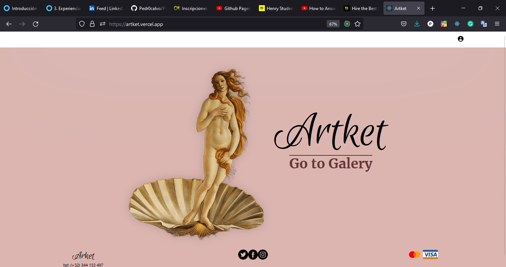
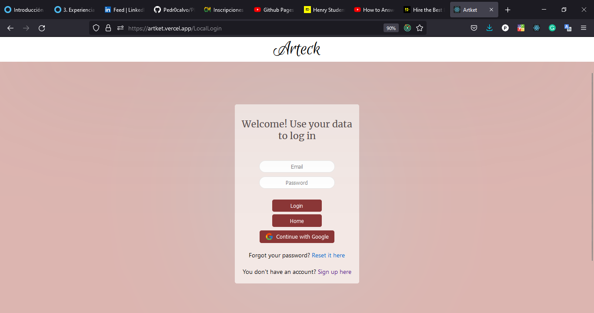

## Artket

 </img>

## Introduction

This repository is the frontend of a project that I did with my partners. This project is a website where we sell artwork.
Im decided to separate the repositorie of the project in the folder of backend and the frontend because its easier for the deveployment.
For the deployment of this folder, I used a site called Vercel.
You can visit the repository of the backend in my profile if you wish.

## BoilerPlate

The content of this folder was created with Create React App.

***Technologies:***
The content of this folder was created with Create React App.
We use the next technologies for this project: **Backend**: Node, Express, PostgreSQL, and Javascript. **Frontend**: JavaScript, Reac, Redux, CSS, HTML. Also we use others technologies like Auth0, sweetalert, bcrypt, JSON Web Token, Mercado Pago.

## App

The website has the next a Landing Page.
 </img>

The user can register and login.
**Register**
 </img>

**Login**
 </img>
The user can log in with her credentials or with a google account.

