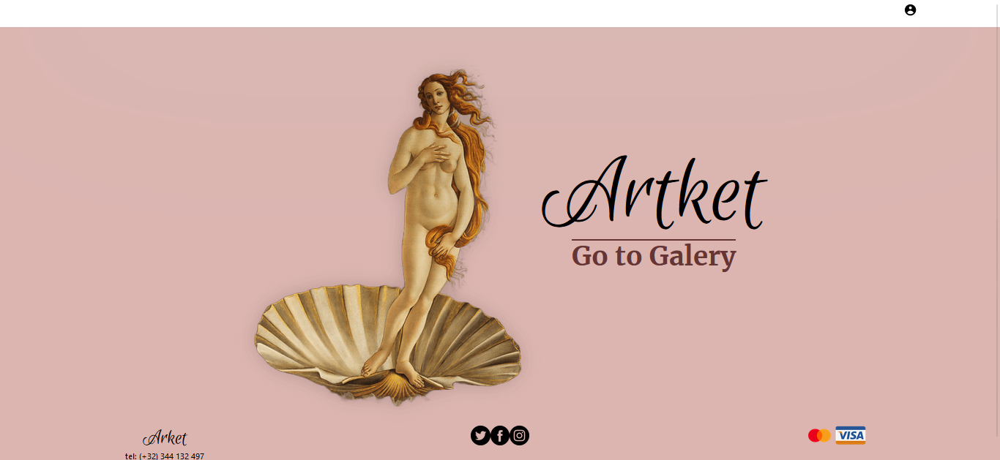

## Artket

 </img>

## Introduction

This repository is the frontend of a project that I did with my partners. This project is a website where we sell artwork.
Im decided to separate the repositorie of the project in the folder of backend and the frontend because its easier for the deveployment.
For the deployment of this folder, I used a site called Vercel.
You can visit the repository of the backend in my profile if you wish.

## BoilerPlate

El boilerplate cuenta con dos carpetas: `api` y `client`. En estas carpetas estará el código del back-end y el front-end respectivamente.

En api crear un archivo llamado: .env que tenga la siguiente forma:

```
DB_USER=usuariodepostgres
DB_PASSWORD=passwordDePostgres
DB_HOST=localhost
```

Reemplazar `usuariodepostgres` y `passwordDePostgres` con tus propias credenciales para conectarte a postgres. Este archivo va ser ignorado en la subida a github, ya que contiene información sensible (las credenciales).

Adicionalmente será necesario que creen desde psql una base de datos con el nombre **repasopi**.

El contenido de client fue creado usando: Create React App.

## Enunciado

En este ejercicio vamos a crear una APP que utilice la API de [Rick and Morty](https://rickandmortyapi.com/). Vamos a crear nuestra app utilizando **REACT* y *REDUX** en la que podremos:

- Ver todos los personajes en la página principal.
- Crear un personaje.

## Endpoints/Flags a utilizar

- [ ] GET https://rickandmortyapi.com/api/character
- [ ] GET https://rickandmortyapi.com/api/episode

## Base de datos

Tendrá los siguientes modelos:

**Character:**

- id
- name
- species
- origin
- image
- created

**Episode:**

- id
- name

La relación de Character y Episode será de muchos a muchos, ya que un personaje puede aparecer en varios episodios, y en un episodio pueden haber varios personajes.

## Backend

Tendrá las siguientes rutas:

- [ ] GET /characters:
  - Obtener el listado de personajes
  - Debe devolver solo los datos necesarios para la ruta principal
- [ ] GET /episodes:
  - Debe devolver un listado con todos los episodios
  - En una primera instancia deberán obtenerlos desde la API externa y guardarlos en su propia base de datos y luego ya utilizarlos desde allí
- [ ] POST /character:
  - Recibe los datos recolectados desde el formulario controlado de la ruta de creación de personaje
  - Crea un personaje en la BDD

## Frontend

Se debe desarrollar una aplicación de React/Redux que contenga las siguientes pantallas/rutas.

**Ruta principal**

- [ ] Área donde se verá el listado de personajes, incluyendo:
  - Imágen
  - Nombre
  - Origen
  - Especie
  - Episodios

**Ruta de creación de personaje**

- [ ] Un formulario _controlado con JavaScript_ con los siguientes campos:
  - Nombre
  - Origen
  - Especie
  - Imágen
- [ ] Posibilidad de agregar uno o más episodios.
- [ ] Botón para crear el personaje.

## Extras

Dependiendo de los tiempos que lleve el repaso, se podría agregar:

- [ ] Paginado
- [ ] Botón para filtrar por personajes traidos de la Api o creados en la BDD
- [ ] GET /character/:id
